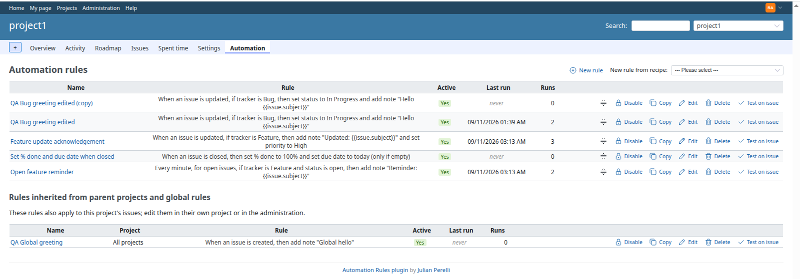
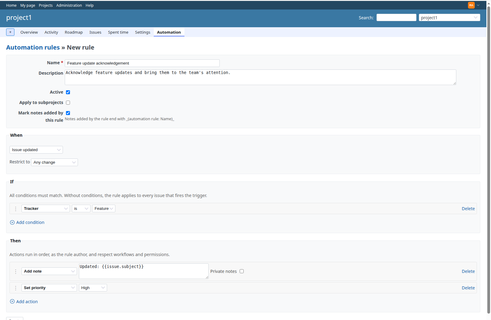
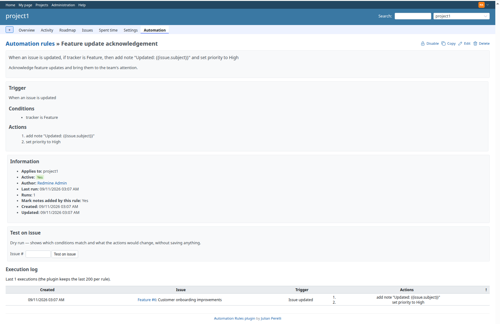
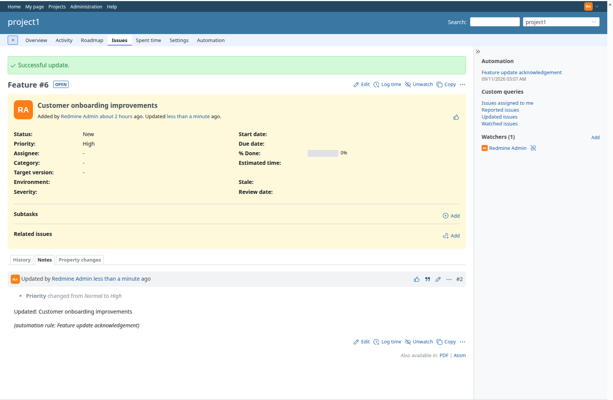
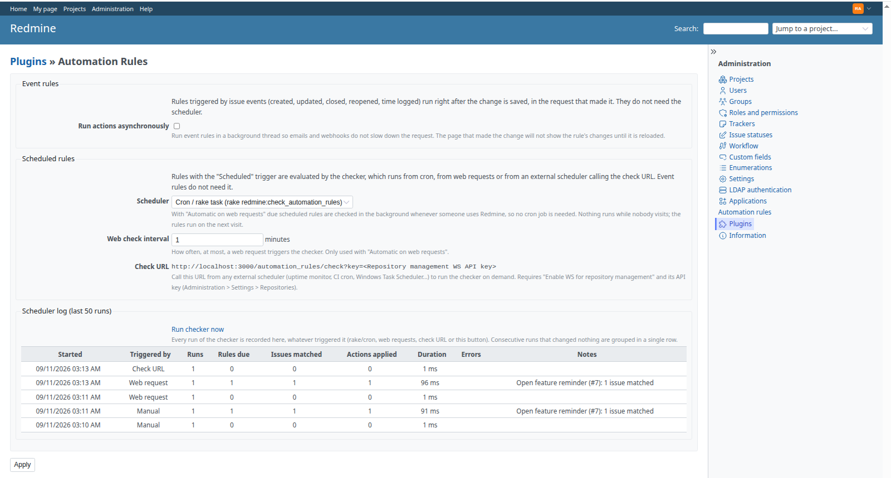

# Redmine Automation Rules  

**No-code automation rules for Redmine.** *When* an issue is created, updated, closed, reopened, gets time logged, or on a schedule; *if* it matches some conditions (tracker, status, priority, assignee, dates, custom fields, ...); *then* do something (set fields, add a note, add watchers, close it, create a subtask, send an email, call a webhook, update the parent). A project manager builds the rules in a form, without writing Ruby.

- Event triggers (issue created / updated / closed / reopened, time entry logged) and scheduled triggers (every N minutes, hours, days or weeks at a time of day).
- Conditions on every core issue field and on custom fields of every format. Actions for every core field, notes with `{{issue.subject}}` variables, watchers, subtasks, emails and webhooks.
- Built-in recipes: auto-close resolved issues, reopen on feedback, close parent when subtasks are done, round-robin assignment, escalation, due-date reminders, stale issues and more.
- Scheduled rules run from cron, **without cron** (checked on web requests) or from any external scheduler through a check URL, exactly like [Redmine Periodic Task](https://github.com/jperelli/Redmine-Periodic-Task).
- Per-rule execution log, global scheduler log, dry run ("Test on issue"), REST API, English and Spanish.
- Redmine 5.1 to 7.0 tested in CI, MIT license.

## Screenshots

The *Automation* tab of a project. Each rule is shown as a sentence, with its last run, run counter and actions (enable/disable, copy, edit, delete, test on an issue). Drag the handle to reorder. Global rules and rules inherited from parent projects are listed below. The *New rule from recipe* dropdown pre-fills the form with one of the built-in recipes:

Creating or editing a rule: *When* (the trigger and its options), *If* (conditions, all must match) and *Then* (actions, applied in order). Rows are added and removed dynamically; the operator and value widgets follow the selected field:

The rule page: the rule as a sentence, its trigger, conditions and actions, a dry-run form and the execution log with the issue, the trigger, the actions applied and any error, for the last 200 executions:

An issue changed by a rule: the note is attributed to the rule's author and ends with the `(automation rule: ...)` marker, and the *Automation* block in the sidebar lists the rules that fired on the issue:

The plugin settings page: asynchronous mode for event rules, scheduler mode for scheduled rules (cron, automatic on web requests, or an external check URL) and the scheduler log:

## How it compares

| | Automation Rules | Redmine core | [redmine_custom_workflows](https://github.com/anteo/redmine_custom_workflows) | AlphaNodes redmine_automation | One-off plugins (auto close, reminders, parent auto close, ...) |
|---|---|---|---|---|---|
| Rules built in a form, no code | yes | workflows only (status transitions, field permissions) | no, Ruby in a textarea | yes | no, fixed behaviour |
| Event triggers (created, updated, closed, time logged) | yes | webhooks (outbound only) | yes | yes | some |
| Scheduled rules (every N hours/days, at HH:MM) | yes, without cron if you want | no | no | yes | each has its own cron task |
| Conditions on custom fields, dates, time spent, parent/subtasks | yes | no | if you code them | yes | no |
| Notes, watchers, emails, webhooks, subtasks, parent update | yes | no | if you code them | yes | one of them each |
| Dry run, per-rule execution log | yes | no | no | ? | no |
| REST API | yes | - | no | ? | no |
| Price | free, MIT | - | free, GPL | paid | free |

Pick this plugin if you keep writing the same reminders, hand-offs and clean-up chores by hand ("close resolved issues after two weeks", "assign new bugs in turn", "close the parent when the last subtask is done", "warn when time spent exceeds the estimate") and want to express them once, in a form, and see when and why they fired. Redmine 5.1 to 7.0 are tested in CI on every change.

## Installation

Run these from your Redmine root. The paths below assume `/opt/redmine`, adjust them to yours:

    cd /opt/redmine
    git clone https://github.com/jperelli/redmine_automation_rules.git plugins/automation_rules
    bundle install
    bundle exec rake redmine:plugins:migrate NAME=automation_rules RAILS_ENV=production

Then restart Redmine so it loads the plugin (see [Restarting Redmine](#restarting-redmine)).

Enable the *Automation rules* module on a project (*Project → Settings → Modules*) and give the *Manage automation rules* permission to the roles that should edit rules and *View automation rules* to those that should only see them (*Administration → Roles and permissions*). The project gets an *Automation* tab. Administrators also get *Administration → Automation rules*, which lists the rules of every project and the **global rules** that apply to every project.

## Upgrade

    cd /opt/redmine/plugins/automation_rules
    git pull
    bundle install
    bundle exec rake redmine:plugins:migrate NAME=automation_rules RAILS_ENV=production

Then restart Redmine (see [Restarting Redmine](#restarting-redmine)).

## Uninstallation

    cd /opt/redmine
    bundle exec rake redmine:plugins:migrate NAME=automation_rules VERSION=0 RAILS_ENV=production
    rm -rf plugins/automation_rules

Then restart Redmine (see [Restarting Redmine](#restarting-redmine)). Notes and changes already made by rules stay in the issues' history.

### Restarting Redmine

How you restart Redmine depends on how you serve it:

- **Puma / Unicorn under systemd:** `sudo systemctl restart redmine`
- **Passenger (Apache or nginx):** `touch /opt/redmine/tmp/restart.txt`
- **Docker:** `docker compose restart redmine`

## Configuration

Rules with an **event** trigger (issue created, updated, closed, reopened, time entry logged) run right after the change is saved, in the request that made it. They need no configuration. Rules with the **Scheduled** trigger need something to check, now and then, which of them are due and evaluate them. Pick one of:

| Mode | Needs | Timing | Best for |
|---|---|---|---|
| [Cron](#option-a-cron-default) (default) | shell access to the server, cron | exact | classic Linux installs |
| [Automatic on web requests](#option-b-automatic-on-web-requests-no-cron) | nothing | on the first visit after a rule is due | Windows, Docker, shared hosting, anyone who can't or doesn't want to set up cron |
| [Check URL](#option-c-check-url-external-scheduler) | an external scheduler that can call a URL | as exact as the external scheduler | exact runs without cron on the Redmine host |

You can combine the modes. Running the checker more than once is harmless: a scheduled rule only runs when its next run time has passed, and each run moves that time forward once, whatever triggered it.

### Option A: cron (default)

A rake task evaluates the due scheduled rules. You run it from cron. Cron has a minimal `PATH`, so use the absolute path to `bundle`. Find it with `which bundle`. With rbenv it looks like `/home/redmine/.rbenv/shims/bundle`, with a system Ruby like `/usr/local/bin/bundle`.

Edit the crontab of the user that owns your Redmine install (`crontab -e`) and add one of the lines below. Replace `/opt/redmine` with your Redmine root and `/usr/local/bin/bundle` with the path from `which bundle`. Run it at least as often as your most frequent rule: a rule "every 10 minutes" needs the checker every 10 minutes (or less).

Every 5 minutes:

    */5 * * * * cd /opt/redmine && /usr/local/bin/bundle exec rake redmine:check_automation_rules RAILS_ENV=production

Once per hour:

    0 * * * * cd /opt/redmine && /usr/local/bin/bundle exec rake redmine:check_automation_rules RAILS_ENV=production

Once a day, at 01:00 (enough when all your scheduled rules run daily or weekly at a time of day before that):

    0 1 * * * cd /opt/redmine && /usr/local/bin/bundle exec rake redmine:check_automation_rules RAILS_ENV=production

### Option B: automatic on web requests (no cron)

Go to *Administration → Plugins → Automation Rules → Configure* and set **Scheduler** to *Automatic on web requests*. From then on, every request to Redmine (any page, any user, the API too) checks whether the **Web check interval** (default 5 minutes) has passed since the last check. If it has, the checker runs in a background thread of the web process, so the request itself is not slowed down. A row in `automation_rules_scheduler_locks` makes sure only one process runs the check per interval, even with several Puma/Passenger workers or several application servers.

Things to know:

- Nothing happens while nobody uses Redmine. A rule due on Saturday runs on the first visit on Monday morning. Occurrences missed in between are coalesced into that one run.
- Notes added by scheduled rules render in Redmine's default language. The `LOCALE` variable only applies to the rake task (`LOCALE=es bundle exec rake ...`).
- You can still run the rake task by hand or from cron at the same time.

### Option C: check URL (external scheduler)

The plugin exposes `GET|POST /automation_rules/check?key=<API key>`. It runs the checker right away and answers `Automation rules: N rule(s) run`. It is protected like Redmine's own `/sys` endpoints: enable *Administration → Settings → Repositories → Enable WS for repository management* and use the API key shown there. The plugin configuration page shows the full URL.

Call it from any scheduler you have, for example:

- an uptime monitor (UptimeRobot, healthchecks.io, ...) pinging the URL every 5 minutes
- a GitHub Actions / GitLab CI scheduled workflow running `curl -fsS "https://redmine.example.com/automation_rules/check?key=..."`
- Windows Task Scheduler running `curl.exe -fsS "https://redmine.example.com/automation_rules/check?key=..."`
- a Kubernetes `CronJob` with a `curlimages/curl` container

The endpoint works whatever the **Scheduler** setting is.

### Scheduler log

The plugin configuration page (*Administration → Plugins → Automation Rules → Configure*) shows the last 50 runs of the checker, whatever triggered them: cron/rake, a web request, the check URL or the *Run checker now* button. Each row shows when the run started, how many scheduled rules were due, how many issues matched their conditions, how many actions were applied, how long it took, any errors (an action Redmine refused, with the rule and the issue), and notes (how many issues each rule matched, rules skipped because their project has the module disabled). Use it to confirm that your cron, uptime monitor or CI schedule is really firing. Consecutive runs that changed nothing are grouped in one row, with a run counter and the time of the last one, so the 50 rows cover days of history even with a 5-minute web-request interval.

The *Run checker now* button on the same page runs the checker at once. Handy to test a setup without waiting for the scheduler. *Run now* on a scheduled rule's page evaluates that single rule right away, without touching its schedule.

### Event rules and background work

Event rules run inline, in the web request (or API call) that saved the issue, as the rule's author. Emails and webhooks sent by event rules are therefore sent before the response is returned. Tick **Run actions asynchronously** on the configuration page to run event rules in a background thread instead; the page that made the change then does not show the rule's changes until it is reloaded. A rule whose action saves an issue can trigger other rules, but not itself on the same issue in the same chain, and chains stop after 3 levels.

## Writing rules

A rule is *When* (one trigger), *If* (conditions, all must match; none means "every issue that fires the trigger") and *Then* (actions, applied in order). It belongs to a project (tick **Apply to subprojects** to cover them too) or, for administrators, to every project (global rules). Actions run **as the rule's author** and go through Redmine's normal validations, workflow and permissions: what the author could not do in the issue form, the rule cannot do either. A refused action is recorded on the rule (*Last error*) and in its execution log; it never breaks the user's request.

### Triggers

| Trigger | Fires | Options |
|---|---|---|
| Issue created | after the issue is saved for the first time | |
| Issue updated | after any later save | restrict to: field X changed, status changed to S, assignee changed, note added, % done reached 100, due date changed |
| Issue closed / Issue reopened | when the status goes from open to closed, or back | |
| Time entry logged | after a time entry is created on an issue | |
| Scheduled | every N minutes / hours / days / weeks, optionally at HH:MM (in the author's time zone), for the open issues of the project(s) that match the conditions | see [Configuration](#configuration) for what runs the checker |

Event rules fire in the request that saved the issue (inline, or in a background thread with **Run actions asynchronously** in the settings). A rule whose action saves the issue can fire other rules, but never itself on the same issue in the same chain, and chains stop after 3 levels. Scheduled rules run each action once per issue per occurrence; running the checker twice does not repeat them (see [Configuration](#configuration)).

### Conditions

Tracker, status (is / is not / is open / is closed), priority (is / is not / at least / at most), assignee (is user, is nobody, is anybody, is the author, is the current user, in / not in group), author, category, target version, % done, due date and start date (empty, set, past, today, within N days, more than N days ago / ahead), subject and description (contains, starts with, matches a regular expression), number of watchers, parent issue (has / has none / parent open / parent closed / exists and all its subtasks are closed), subtasks (none, any, all closed, any open), private flag, time spent (more / less than N hours, exceeds / within the estimate, none), last updated / created more or less than N days or hours ago, and **custom fields** of every core format (string, text, integer, float, list, boolean, date, user, version), with the operators of the format.

### Actions

| Action | Notes |
|---|---|
| Set status, priority, tracker, category, target version, % done, private flag | |
| Set assignee | a user, the author, the current user, the previous assignee, nobody, or **round-robin** among the members of a group |
| Set start date / due date | a date, today, `+N` / `-N` days from today or from the other date, or clear it; *only if empty* and *shift to the next working day* options |
| Set custom field | any format; accepts variables and date macros (`**DATE**`, `**DATE+7**`, `**MONTHNAME**`, ...) |
| Add note | with variables, optionally private; the note is attributed to the rule's author and ends with `_(automation rule: Name)_` unless you untick **Mark notes added by this rule** |
| Add / remove watchers | a user, the author, the assignee, the current user, all members of a role, or a group |
| Close the issue / Reopen the issue | first closed (or open) status the workflow allows the author to reach |
| Create a subtask / a related issue | from a template: tracker, subject, description, assignee, relation type |
| Send an email | to a user, the author, the assignee, the current user, a role, a group, the watchers or plain addresses; subject and body with variables |
| Call a webhook | `POST` JSON payload (issue, trigger, rule, user) to a URL, in a background thread; an optional secret is sent as `X-Automation-Rules-Secret` and as an HMAC-SHA256 `X-Automation-Rules-Signature` of the body |
| Update the parent issue | apply one of close, reopen, set status, set % done, set priority or add note to the parent |

### Variables

Notes, emails, custom field values and issue templates accept `{{issue.id}}`, `{{issue.subject}}`, `{{issue.description}}`, `{{issue.tracker}}`, `{{issue.status}}`, `{{issue.priority}}`, `{{issue.author}}`, `{{issue.assigned_to}}`, `{{issue.category}}`, `{{issue.fixed_version}}`, `{{issue.start_date}}`, `{{issue.due_date}}`, `{{issue.done_ratio}}`, `{{issue.estimated_hours}}`, `{{issue.spent_hours}}`, `{{issue.url}}`, `{{issue.cf.Field name}}` (any custom field, by name), `{{project.name}}`, `{{project.identifier}}`, `{{user}}` (who made the change), `{{rule.name}}`, `{{date}}` and `{{time}}`, plus Periodic Task's date macros: `**DAY**`, `**MONTH**`, `**MONTHNAME**`, `**YEAR**`, `**WEEK**`, `**WEEKISO**`, `**QUARTER**`, `**DATE**` with an optional day offset (`**DATE+7**`, `**MONTH-1**`), and `**NEXT_WEEK**`, `**NEXT_MONTH**`, `**PREVIOUS_MONTH**` with their `_YEAR` / `MONTHNAME` companions. `{{issue.id}}` is the bare number; write `#{{issue.id}}` to get a link.

### Recipes

*New rule from recipe* on the rule list pre-fills the form; edit what you like and save. Names (statuses *Resolved* / *In Progress*, priority *High*, role *Manager*, custom field *Stale*, ...) are looked up in your Redmine when the recipe is applied and fall back to sensible defaults when they do not exist.

| Recipe | Rule |
|---|---|
| Auto-close resolved issues | every day at 02:00, issues *Resolved* and not updated for 14 days → add a note and close |
| Reopen when the reporter comments on a closed issue | note added, issue closed, note by the issue's author → reopen |
| Close the parent when all subtasks are closed | issue closed, parent exists and all its subtasks are closed → close the parent |
| Round-robin assignment | issue created without assignee → assign in turn among a group |
| Start date when work starts | status changed to *In Progress* → set start date to today if empty |
| Finish on close | issue closed → set % done 100 and due date today if empty |
| Escalate unassigned high-priority issues | every hour, priority ≥ *High*, unassigned, created more than 4 hours ago → add the *Manager* role as watchers and add a note |
| Due-date reminder | every day at 09:00, open issues due within 2 days → email the assignee |
| Stale issues | every week, open issues not updated for 90 days → add a note and set custom field *Stale* (skipped when there is no such field) |
| Assign by category | issue created in category C without assignee → assign to a user |
| Time budget exceeded | time logged, spent > estimated → add a note and add the *Manager* role as watchers |

### Testing a rule

*Test on issue* (on the list and on the rule page) evaluates the rule on an issue you pick and shows which conditions matched and what each action would change, **without saving anything**. When everything matches you can then *Run for real on #N*. *Run now* on a scheduled rule evaluates it right away without touching its schedule.

## REST API

Rules can be listed, created, updated, deleted, tested and run through Redmine's REST API, in JSON or XML, like the core API. Enable *Administration → Settings → API → Enable REST web service* and authenticate with an API key (`X-Redmine-API-Key` header or `key=` parameter) or HTTP basic auth. The user needs the *Manage automation rules* permission (or *View automation rules* for `GET`) and the module must be enabled, exactly like for the HTML pages. Global rules use the same paths without the `/projects/:project_id` prefix and require an administrator.

| Method | Path | Description |
|---|---|---|
| `GET` | `/projects/:project_id/automation_rules.json` | The project's own rules, in order |
| `GET` | `/projects/:project_id/automation_rules/:id.json` | One rule, with its last 50 `executions` (`issue_id`, `trigger`, `actions`, `error`, `created_at`) |
| `POST` | `/projects/:project_id/automation_rules.json` | Create a rule. Answers `201 Created` with the rule and a `Location` header |
| `PUT`/`PATCH` | `/projects/:project_id/automation_rules/:id.json` | Update a rule; only the attributes sent are changed. Answers `204 No Content` |
| `DELETE` | `/projects/:project_id/automation_rules/:id.json` | Delete a rule. Answers `204 No Content` |
| `POST` | `/projects/:project_id/automation_rules/:id/run_now.json` | Run the rule for real: on issue `issue_id=N` (required for event rules), or on every open issue of the project(s) for a scheduled rule, without touching its schedule. Answers the per-issue results |
| `POST` | `/projects/:project_id/automation_rules/:id/test.json?issue_id=N` | Dry run on issue N: matched conditions, actions and field changes that would be applied. Nothing is saved |
| `GET` | `/projects/:project_id/automation_rules/fields` | The form schema: triggers, condition and action types with their parameters, and the project's option lists (session-authenticated, used by the form) |

A rule is rendered with `id`, `name`, `description`, `active`, `position`, `project` (`{id, name}`, absent for global rules), `apply_to_subprojects`, `note_marker`, `author`, `trigger_type`, `trigger_options`, `sentence`, `conditions` and `actions` (arrays of `{type, ...params}` objects, the same the form posts), `last_run_at`, `next_run_at`, `last_error`, `runs_count`, `created_on` and `updated_on`. Create and update take the same attributes under an `automation_rule` key:

    curl -H "X-Redmine-API-Key: $KEY" -H "Content-Type: application/json" -X POST \
      https://redmine.example.com/projects/project1/automation_rules.json -d '{
        "automation_rule": {
          "name": "Bugs go to QA when closed",
          "trigger_type": "issue_closed",
          "conditions": [{"type": "tracker", "operator": "is", "value": "1"}],
          "actions": [{"type": "add_watchers", "who": "role", "role_id": "3"},
                      {"type": "add_note", "text": "Closed: {{issue.subject}}"}]
        }
      }'

`trigger_type` is one of `issue_created`, `issue_updated`, `issue_closed`, `issue_reopened`, `time_entry_logged`, `scheduled`. `trigger_options` carries the trigger's sub-options (`change` and its value for *Issue updated*; `interval_number`, `interval_unit` and `time_of_day` for *Scheduled*). The type keys and parameters of conditions and actions are the ones returned by `/fields`. Validation errors answer `422` with `{"errors": [...]}`, an unknown rule `404`, a missing permission `403`.

## Development

Run `docker compose build`, then `./provision.sh` (it creates the database, loads Redmine's default data and seeds a project with sample users, custom fields, issues and a few rules built from the recipes) and `docker compose up -d redmine`.

Then go to http://127.0.0.1:3000/ and log in with

    user: admin
    pass: admin

You should see a project named *project1* with the *Automation rules* module enabled.

Tests run in docker too, against the Redmine version of your choice:

    docker build -f Dockerfile.test --build-arg REDMINE_TAG=7.0-bookworm -t automation-rules-test .
    docker run --rm automation-rules-test

CI runs RuboCop and the test suite on Redmine 5.1, 6.0, 6.1 and 7.0 (`.github/workflows/test.yml`). To lint locally without Ruby on the host:

    docker run --rm -v "$PWD":/app -w /app redmine:7.0-bookworm sh -c 'gem install rubocop -v 1.81.1 --no-document -q && rubocop'

## Redmine version support

| Redmine | Ruby (docker image) | Tested in CI |
|---|---|---|
| 5.1 | 3.2 | yes |
| 6.0 | 3.3 | yes |
| 6.1 | 3.4 | yes |
| 7.0 | 4.0 | yes |

The plugin requires Redmine 5.1 or newer (`requires_redmine version_or_higher: '5.1.0'`) and works with SQLite, MySQL and PostgreSQL. The UI is plain JavaScript on Redmine's jQuery, no build step.

## Known limitations

- Webhook and email actions of event rules run inline in the request that saved the issue unless **Run actions asynchronously** is enabled in the plugin settings.
- Scheduled rules only look at **open** issues.
- Action descriptions in the execution log and the scheduler log are stored in the language of the user who triggered them.
- A rule action on issue A can fire rules on other issues (a subtask, the parent); chains stop after 3 levels and are logged.

## Authors

  - [Julian Perelli](https://jperelli.com.ar/)

## License

MIT
