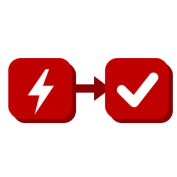

# Redmine Automation Rules  

**No-code automation rules for Redmine.** *When* an issue is created, updated, closed, reopened, gets time logged, or on a schedule; *if* it matches some conditions (tracker, status, priority, assignee, dates, custom fields, ...); *then* do something (set fields, add a note, add watchers, close it, create a subtask, send an email, call a webhook, update the parent). A project manager builds the rules in a form, without writing Ruby.

- Event triggers (issue created / updated / closed / reopened, time entry logged) and scheduled triggers (every N minutes, hours, days or weeks at a time of day).
- Conditions on every core issue field and on custom fields of every format. Actions for every core field, notes with `{{issue.subject}}` variables, watchers, subtasks, emails and webhooks.
- Built-in recipes: auto-close resolved issues, reopen on feedback, close parent when subtasks are done, round-robin assignment, escalation, due-date reminders, stale issues and more.
- Scheduled rules run from cron, **without cron** (checked on web requests) or from any external scheduler through a check URL, exactly like [Redmine Periodic Task](https://github.com/jperelli/Redmine-Periodic-Task).
- Per-rule execution log, global scheduler log, dry run ("Test on issue"), REST API.
- Redmine 5.1 to 7.0 tested in CI, MIT license.

> Work in progress: recipes, the per-rule execution log and the issue sidebar land in the following pull requests.

## Installation

Run these from your Redmine root. The paths below assume `/opt/redmine`, adjust them to yours:

    cd /opt/redmine
    git clone https://github.com/jperelli/redmine_automation_rules.git plugins/automation_rules
    bundle install
    bundle exec rake redmine:plugins:migrate NAME=automation_rules RAILS_ENV=production

Then restart Redmine so it loads the plugin. Enable the *Automation rules* module on a project: the project gets an *Automation* tab.

## Configuration

Rules with an **event** trigger (issue created, updated, closed, reopened, time entry logged) run right after the change is saved, in the request that made it. They need no configuration. Rules with the **Scheduled** trigger need something to check, now and then, which of them are due and evaluate them. Pick one of:

| Mode | Needs | Timing | Best for |
|---|---|---|---|
| [Cron](#option-a-cron-default) (default) | shell access to the server, cron | exact | classic Linux installs |
| [Automatic on web requests](#option-b-automatic-on-web-requests-no-cron) | nothing | on the first visit after a rule is due | Windows, Docker, shared hosting, anyone who can't or doesn't want to set up cron |
| [Check URL](#option-c-check-url-external-scheduler) | an external scheduler that can call a URL | as exact as the external scheduler | exact runs without cron on the Redmine host |

You can combine the modes. Running the checker more than once is harmless: a scheduled rule only runs when its next run time has passed, and each run moves that time forward once, whatever triggered it.

### Option A: cron (default)

A rake task evaluates the due scheduled rules. You run it from cron. Cron has a minimal `PATH`, so use the absolute path to `bundle`. Find it with `which bundle`. With rbenv it looks like `/home/redmine/.rbenv/shims/bundle`, with a system Ruby like `/usr/local/bin/bundle`.

Edit the crontab of the user that owns your Redmine install (`crontab -e`) and add one of the lines below. Replace `/opt/redmine` with your Redmine root and `/usr/local/bin/bundle` with the path from `which bundle`. Run it at least as often as your most frequent rule: a rule "every 10 minutes" needs the checker every 10 minutes (or less).

Every 5 minutes:

    */5 * * * * cd /opt/redmine && /usr/local/bin/bundle exec rake redmine:check_automation_rules RAILS_ENV=production

Once per hour:

    0 * * * * cd /opt/redmine && /usr/local/bin/bundle exec rake redmine:check_automation_rules RAILS_ENV=production

Once a day, at 01:00 (enough when all your scheduled rules run daily or weekly at a time of day before that):

    0 1 * * * cd /opt/redmine && /usr/local/bin/bundle exec rake redmine:check_automation_rules RAILS_ENV=production

### Option B: automatic on web requests (no cron)

Go to *Administration → Plugins → Automation Rules → Configure* and set **Scheduler** to *Automatic on web requests*. From then on, every request to Redmine (any page, any user, the API too) checks whether the **Web check interval** (default 5 minutes) has passed since the last check. If it has, the checker runs in a background thread of the web process, so the request itself is not slowed down. A row in `automation_rules_scheduler_locks` makes sure only one process runs the check per interval, even with several Puma/Passenger workers or several application servers.

Things to know:

- Nothing happens while nobody uses Redmine. A rule due on Saturday runs on the first visit on Monday morning. Occurrences missed in between are coalesced into that one run.
- Notes added by scheduled rules render in Redmine's default language. The `LOCALE` variable only applies to the rake task (`LOCALE=es bundle exec rake ...`).
- You can still run the rake task by hand or from cron at the same time.

### Option C: check URL (external scheduler)

The plugin exposes `GET|POST /automation_rules/check?key=<API key>`. It runs the checker right away and answers `Automation rules: N rule(s) run`. It is protected like Redmine's own `/sys` endpoints: enable *Administration → Settings → Repositories → Enable WS for repository management* and use the API key shown there. The plugin configuration page shows the full URL.

Call it from any scheduler you have, for example:

- an uptime monitor (UptimeRobot, healthchecks.io, ...) pinging the URL every 5 minutes
- a GitHub Actions / GitLab CI scheduled workflow running `curl -fsS "https://redmine.example.com/automation_rules/check?key=..."`
- Windows Task Scheduler running `curl.exe -fsS "https://redmine.example.com/automation_rules/check?key=..."`
- a Kubernetes `CronJob` with a `curlimages/curl` container

The endpoint works whatever the **Scheduler** setting is.

### Scheduler log

The plugin configuration page (*Administration → Plugins → Automation Rules → Configure*) shows the last 50 runs of the checker, whatever triggered them: cron/rake, a web request, the check URL or the *Run checker now* button. Each row shows when the run started, how many scheduled rules were due, how many issues matched their conditions, how many actions were applied, how long it took, any errors (an action Redmine refused, with the rule and the issue), and notes (how many issues each rule matched, rules skipped because their project has the module disabled). Use it to confirm that your cron, uptime monitor or CI schedule is really firing. Consecutive runs that changed nothing are grouped in one row, with a run counter and the time of the last one, so the 50 rows cover days of history even with a 5-minute web-request interval.

The *Run checker now* button on the same page runs the checker at once. Handy to test a setup without waiting for the scheduler. *Run now* on a scheduled rule's page evaluates that single rule right away, without touching its schedule.

### Event rules and background work

Event rules run inline, in the web request (or API call) that saved the issue, as the rule's author. Emails and webhooks sent by event rules are therefore sent before the response is returned. Tick **Run actions asynchronously** on the configuration page to run event rules in a background thread instead; the page that made the change then does not show the rule's changes until it is reloaded. A rule whose action saves an issue can trigger other rules, but not itself on the same issue in the same chain, and chains stop after 3 levels.

## Development

Run `docker compose build`, then `./provision.sh` (it creates the database, loads Redmine's default data and seeds a project with sample users and custom fields) and `docker compose up -d redmine`.

Then go to http://127.0.0.1:3000/ and log in with

    user: admin
    pass: admin

You should see a project named *project1* with the *Automation rules* module enabled.

Tests run in docker too, against the Redmine version of your choice:

    docker build -f Dockerfile.test --build-arg REDMINE_TAG=7.0-bookworm -t automation-rules-test .
    docker run --rm automation-rules-test

## Authors

  - [Julian Perelli](https://jperelli.com.ar/)

## License

MIT
